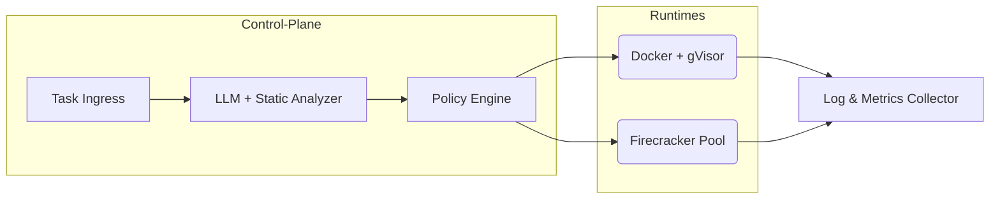

# Hybrid-Sandbox Runtime (HSR)

> **Goal**\tProvide a *pluggable*, *policy-driven* sandbox platform that can  \
> dynamically route each task to the safest/fastest backend—`Docker`,  \
> `Docker + gVisor`, or `Firecracker MicroVM`—based on automated risk analysis.

---

## 1  Why HSR?

| Need                              | Traditional Container | HSR Advantage                               |
|-----------------------------------|-----------------------|---------------------------------------------|
| Run mostly-trusted code           | Use plain Docker      | 🟢 chooses lightweight path                  |
| Run untrusted user code           | Manual gVisor setup   | 🟢 auto-routes to gVisor                     |
| High-risk / multi-tenant workloads| Heavy VMs             | 🟢 falls back to Firecracker only when needed|
| Unified API & logs                | N/A                   | 🟢 single interface, common logging          |

---

## 2  High-Level Architecture



* **LLM + Static Analyzer** – scores risk (unknown binaries, network perms, etc.).  
* **Policy Engine** – maps score → runtime class *(low, medium, high)*.  
* **Runtimes** – concrete sandbox backends implementing the same Go interface.  
* **Collector** – ships stdout/stderr, resource stats, exit codes.

---

## 3  Key Features

* 🔌 **Pluggable backends** – drop-in support for new runtimes (e.g. WASM).
* 🔒 **Tiered isolation** – escalate from container → user-space kernel → micro-VM.
* ⚖️ **Policy-driven scheduling** – YAML / Rego / LLM hybrid.
* 📜 **Unified API** – one gRPC surface regardless of backend.
* 📊 **Observability** – Prom-style metrics, structured JSON logs.

---

## 4  Quick Start (dev)

```bash
# clone
git clone https://github.com/your-org/hsr && cd hsr

# spin up demo (Docker + gVisor only)
make up          # builds scheduler + example backend

# run sample job
hsrctl run --image golang:1.22 -- cmd "go test ./..."
```

> **Firecracker demo requires KVM; see `docs/firecracker.md`.**

---

## 5  Core Go Interfaces

```go
// sandbox/runtime.go
type Runtime interface {
    // Run starts a task and returns immediately with an ID.
    Run(ctx context.Context, t Task) (id string, err error)

    // Wait blocks until the task exits or ctx is cancelled.
    Wait(ctx context.Context, id string) (Result, error)

    // Kill sends SIGKILL/ACPI/etc. A no-op if task already finished.
    Kill(ctx context.Context, id string) error
}

// scheduler/strategy.go
type Strategy interface {
    SelectRuntime(task TaskMeta) (runtimeName string, reason string)
}
```

Concrete adapters live under `internal/runtime/{docker,gvisor,firecracker}`.
Each runtime is implemented as a thin wrapper around the corresponding CLI:
`docker`, `docker --runtime=runsc`, and `ignite` for Firecracker.

---

## 6  Configuration Example

```yaml
# config/policy.yaml
rules:
  - match:
      lang: "python"
      network: false
    use: "gvisor"

  - match:
      binary: true
      unknown-lang: true
    use: "firecracker"

default: "docker"
```

Policies are hot-reloadable.

---

## 7  Roadmap

| Milestone | Target                                         |
|-----------|------------------------------------------------|
| **v0.1**  | Docker + gVisor runtime, YAML policy, basic CLI|
| **v0.2**  | Firecracker adapter, pre-warmed VM pool         |
| **v0.3**  | LLM risk-scorer (OpenAI function call)          |
| **v1.0**  | HA scheduler, Kubernetes CRD operator           |

---

## 8  Contributing

1. Fork & branch (`feat/...`).  
2. `make test` – all green.  
3. Open PR; follow the **Conventional Commits** spec.

---

## 9  License

Apache 2.0 © 2025 HSR Contributors
